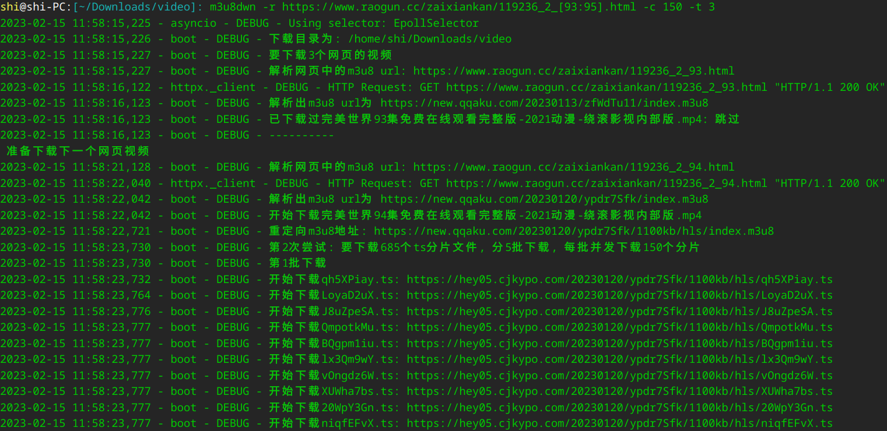

[GitHub](https://github.com/shigebeyond/m3u8dwn) | [Gitee](https://gitee.com/shigebeyond/m3u8dwn)

# m3u8dwn - m3u8视频下载器
## 概述
python实现的m3u8视频多协程下载器，支持多个ts切片文件同时下载；

初始版，是使用requests库+多线程来实现的，下载速度还行，就是电脑经常卡住，因为线程被频繁创建、占用、切换；

最终版，是使用httpx异步请求库+多协程来实现，下载速度嗖嗖的，电脑不卡，并发下载数随便加。

- 支持功能
1. 通过m3u8地址下载视频
2. 通过网页解析出m3u8地址，并下载视频
3. 并发下载ts分片文件 + 解密 + 合并为mp4 
4. 可指定ts并发下载数
5. 当ts文件下载失败后，会自动重试1次
4. 可指定下载目录
5. 断点续传：当命令半途中断后，可重新执行命令，因为下载目录与视频地址不变，他会继续上次未完成的下载
6. 打日志

## 使用
### 1. 安装
```
pip install m3u8dwn
```

### 2. 下载命令
2.1 命令格式
```
m3u8dwn -m m3u8地址 -p 内含m3u8地址的网页地址 -r 网页地址范围 -o 输出目录 [-f 下载文件名] [-c 并发下载数] 
```

其中选项有:

`-m`与`-p`与`-r`是三选一;

`-m`为 m3u8 url;

`-p`为 网页url, 网页内容需包含m3u8 url, 同时其标题可作为输出文件名;

`-r`为 网页url范围, url包含范围表达式, 如[1:3], 范围中的每个元素代表一个url;

`-o`可省, 为输出目录, 默认为当前目录;

`-f`可省, 为输出文件名, 默认是网页标题.mp4或result.mp4;

`-c`可省, 为并发下载数, 默认为200

`-t`可省, 为重试次数, 默认为2

2.2 例子
```
# 通过m3u8地址下载视频，下载目录为当前目录，-m指定m3u8地址
m3u8dwn -m http://xxx.com/yyy.m3u8

# -o指定下载目录
m3u8dwn -m http://xxx.com/yyy.m3u8 -o /home/shi/video

# 通过网页解析出m3u8地址，并下载视频，-p指网页地址
m3u8dwn -p http://xxx.com/yyy.html 

# -r指定网页url范围，其中[1:3]是范围表达式，代表遍历从1到3的数字元素, 每个元素代表一个url，命令会遍历每个url来下载视频
m3u8dwn -r http://xxx.com/yyy-[1:3].html 

# -c指定并发下载数为150
m3u8dwn -m http://xxx.com/yyy.m3u8 -c 150

# -t指定重试次数为3
m3u8dwn -m http://xxx.com/yyy.m3u8 -t 3
```

2.3 运行效果
